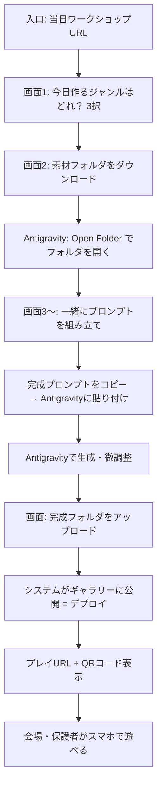

# 子ども向けAIイベント — ワークショップ＋ギャラリー 要件定義書（v0.3）

> **目的:** 次回開催する「保護者同伴・子ども向けAI体験」において、**本システム上でプロンプトを組み立て → コピー → Antigravity で制作** という運用を安全・再現性高く行い、成果物は従来どおり **ギャラリー＋プレイ** として公開できるようにするための全体設計のたたき台。

**関連:** [SYSTEM_OVERVIEW.md](../SYSTEM_OVERVIEW.md)（現行ギャラリー・体験ページ・管理画面）

---

## 1. 背景とビジョン

### 1.1 背景

- これまで「ゼロからバイブコーディング」に近い進行だと、**トークン消費・時間・品質のばらつき**が大きい。
- 当日は **子ども＋保護者** がペアで Antigravity にプロンプトを入力するため、**入力する文言をこちらで設計・固定化**した方が運営しやすい。
- 会場側は **素材（画像・仕様・ベースゲーム）** を用意し、参加者は **ジャンル選択 → アレンジ選択** だけで完成に近いプロンプトを得る。

### 1.2 ビジョン（一言）

**「選ぶだけで、コピーするだけで、みんな同じ土台からオリジナルゲームができる」** 体験を、1つのWebシステム（ギャラリー＋当日導線）で支える。

### 1.3 本システムと Antigravity の役割分担

| 役割 | 本システム | Antigravity（外部） |
|------|------------|---------------------|
| ジャンル・題材の提示 | ◎ | — |
| 素材・制約・仕様の説明（子ども向けUI） | ◎ | — |
| **最終プロンプトの生成（トークン設計済み）** | ◎ | 受け取り側 |
| プロンプトのコピー | ◎ | 保護者が貼り付け |
| コード生成・編集・実行 | — | ◎（**Open Folder** で素材フォルダを開いた状態） |
| **スターター素材フォルダの配布** | ◎ ZIPダウンロード | 解凍 → Open Folder |
| **プロンプトを一緒に組み立てるUI** | ◎ 選択肢ウィザード | — |
| 完成フォルダの **アップロード・公開（デプロイ）** | ◎ ギャラリー掲載 | 完成物はフォルダごと提出 |
| 公開後の **プレイURL・QR** | ◎ 作品ページ／当日一覧 | — |

---

## 2. ステークホルダーとペルソナ

| ペルソナ | 目的 | 端末・操作 |
|----------|------|------------|
| **子ども（小〜中学年想定）** | 作りたいゲームを選び、見た目・ルールの「好き」を選ぶ | タブレット／会場PC（タッチ） |
| **保護者** | Antigravity への貼り付け、生成結果の保存・提出を支援 | 自分のPC or 会場端末 |
| **スタッフ** | 進行・トラブル対応・作品受付・ギャラリー反映 | 管理画面 |
| **来場者（イベント後）** | みんなの作品を見て遊ぶ | スマホ・PC |

---

## 3. 3ジャンル（固定）

初回イベントでは **ジャンルは3種に固定** する。

| ID（案） | 名称 | 体験イメージ | 素材の例（会場側で用意） |
|----------|------|--------------|---------------------------|
| `athletic` | アスレチックゲーム | ジャンプ・障害物・ゴール | キャラスプライト、床・障害物、BGM |
| `shooting` | シューティングゲーム | 自機・敵・弾 | 宇宙船・敵・エフェクト（既存素材フォルダと整合） |
| `puzzle` | パズルゲーム | マッチ・スライド・当てはめ | タイル、UI、効果音 |

**共通ルール（要件）**

- 各ジャンルに **1つのベース仕様（テンプレート）** があり、選択肢は **あらかじめ定義された項目のみ**（自由記述は最小限 or なし）。
- ジャンルごとに **選べるアレンジ項目数・組み合わせ** に上限を設け、**生成プロンプトの文字数・トークン量を管理画面で調整可能** にする。

---

## 4. 当日のユーザージャーニー（To-Be）— 確定イメージ

**ゴール:** 会場では Antigravity に **無駄な試行錯誤のプロンプトを打たせない**。素材は **事前に用意したフォルダ** を開き、プロンプトは **本システム上で一緒に組み立ててからコピー**。完成したら **本システムにアップロード → ギャラリー公開 → QRで遊べる** まで一気通貫。



### 4.1 子ども＋保護者（会場ブース）— ステップ詳細

| 順 | 画面・作業 | 誰が | 内容 |
|----|------------|------|------|
| 1 | **ジャンル選択（3画面のうちの入口）** | 子ども中心 | 「今日作っていくゲーム、どれにしよう？」— アスレチック / シューティング / パズルの **3カード** |
| 2 | **素材フォルダ** | 保護者 | ジャンル別 **スターターZIP** をダウンロード → 解凍。中身は `index.html`（空 or 最小）＋ `assets/` 等、**ASCIIフォルダ名**（Storage制約） |
| 3 | **Antigravity** | 保護者 | **File → Open Folder** で解凍したフォルダを開く（以降の生成はこの中に書き込む） |
| 4 | **プロンプト工房** | 子ども＋保護者 | 本システム上で選択肢を進め **一緒に** 内容を固める。画面に **完成プロンプト全文** を表示 |
| 5 | **コピー＆貼り付け** | 保護者 | 「コピー」→ Antigravity のチャットに **1回貼り付け**（追いプロンプトは原則使わない設計） |
| 6 | **制作** | 保護者＋子ども | 生成・プレビュー・必要なら最小限の手直し |
| 7 | **アップロード** | **参加者（保護者）** | 完成した **ゲームフォルダ** を本システムにアップロード（フォルダ選択 / D&D）。**できなかった組はスタッフが代行**（同じアップロード画面 or 管理画面） |
| 8 | **公開・QR** | システム | **アップロード完了と同時に即公開**。完了画面で **プレイURL + QR** を表示（「このQRで遊べます。スタッフでも確認できます」） |

**保護者向けカード（各所に短く表示）**

1. 素材ZIPを落として解凍  
2. Antigravity で **Open Folder**  
3. このサイトでプロンプトを作って **コピー → 貼り付け**  
4. できあがったら **このサイトにフォルダをアップロード** → QRで遊ぶ  

### 4.1a トークン節約のためのUX原則

- Antigravity では **「考える」時間を減らす** — 考えるのは本システムのウィザード上。
- 参加者に自由入力の長文プロンプトを書かせない（MVPは **選択肢のみ**）。
- 完成プロンプトは **1メッセージ完結** を目標にテンプレート設計。
- （Should）文字数・「目安トークン」を結果画面に表示し、スタッフが上限を監視しやすくする。

### 4.2 スタッフ

- ジャンルごとに **スターターフォルダ（ZIP元）** と **プロンプトテンプレート** を事前アップロード
- 当日 **アクティブなワークショップ／開催日** の切替
- **アップロード代行** — 参加者用アップロード画面をスタッフ端末で操作、または管理画面の既存フォルダアップロード
- 参加者アップロードの **監視・非公開切替・削除**（問題作品対応のみ。承認待ちフローは **なし**）
- 開催日ギャラリー・**当日一覧ページのQR**（会場掲示用）の取得
- 公開完了画面のQRを **一緒に確認** し、掲載成功を口頭で伝えられる

### 4.3 体験時間（確定: **90分**）

1組（子ども＋保護者）あたり **90分** を前提に、UIのステップ数と会場進行を設計する。

| ブロック | 目安時間 | 内容 |
|----------|----------|------|
| オリエンテーション | 5分 | 入口URL、今日の流れ、保護者向けカード |
| ジャンル選択 | 5分 | 3択 |
| 素材DL + Open Folder | 10分 | ZIP・解凍・Antigravity起動（保護者作業） |
| プロンプト工房 | 15分 | ウィザードで一緒に選択・完成プロンプト確認 |
| Antigravity 制作 | 45分 | コピー貼り付け・生成・プレビュー・最小調整（**メイン**） |
| アップロード + QR確認 | 10分 | フォルダ提出・即公開・QRで動作確認 |

※ 余裕がなければプロンプト工房を **10分**、制作を **50分** に寄せる。ウィザードは **ステップ数を絞る**（各ジャンル3〜4ステップ目安）。

**90分設計への要件**

- 各画面に **「だいたいあと◯分」** は出さず、ステップ数で短く完結させる（子ども向け）
- プロンプト工房は **戻る** でやり直し可能だが、深い分岐は避ける
- アップロード失敗時用にスタッフ代行を **10分ブロック内** で想定

### 4.3 イベント後

- 従来どおり **開催地 → 開催日 → 作品一覧 → プレイ**

---

## 5. システム構成（3モード）

公開サイトの **用途を3つに分離** し、トップまたは体験ハブから選べるようにする（IA）。

| モード | 名称（案） | 主なユーザー | 現状 |
|--------|------------|--------------|------|
| **A** | ワークショップ（プロンプト工房） | 子ども＋保護者 | **新規** |
| **B** | 体験デモ（遊んでみる・素材） | 当日来場者 | `experience.html` あり（要: ジャンル3固定との整合） |
| **C** | 作品ギャラリー | 一般・保護者 | `index.html` あり |

**統合方針（案）**

- URL は `experience.html#/workshop`（プロンプト）と `#/playground`（デモ＋DL）のように **同一アプリ内ルート** で揃え、デザインシステムは共通。
- ギャラリー（C）は `#/` のまま、当日入口から **「作品を見る」** へリンク。

---

## 6. 機能要件

### 6.1 ワークショップ — Must（MVP）

| ID | 要件 |
|----|------|
| W-01 | 3ジャンルから1つを選べる（タッチ向け大UI） |
| W-02 | ジャンルごとに **定義済みの選択肢** だけでアレンジできる（ウィザード形式） |
| W-03 | 選択結果から **1本の完成プロンプト** を生成する（サーバー or クライアントのテンプレートエンジン） |
| W-04 | **コピーボタン** ＋ コピー成功のフィードバック |
| W-05 | 保護者向け手順（**DL → Open Folder → コピー貼り付け → アップロード**）を常時表示 |
| W-06 | 管理画面で **ジャンル・選択肢・テンプレート・スターターZIP** を編集できる |
| W-07 | 当日表示するイベントを **1つアクティブ** にできる |
| W-08 | ジャンル選択後、**スターター素材フォルダのZIPダウンロード**（Storage → 既存 `zipDownload` 流用） |
| W-09 | **参加者向け** 完成フォルダアップロード（管理画面と同ロジック＋日本語パス安全化）。**スタッフ代行**は同一UI or 管理画面 |
| W-10 | アップロード成功 **即時** に当日開催日ギャラリーへ掲載（`is_published: true`、承認なし） |
| W-11 | 公開直後の完了画面に **プレイURL + QR**。「スタッフでもこのQRで確認できます」文言 |

### 6.2 ワークショップ — Should

| ID | 要件 |
|----|------|
| W-15 | プロンプトの **概算文字数** 表示（トークン目安） |
| W-16 | ジャンル別 **サンプルプレイ**（完成イメージ）への1タップ遷移 |
| W-17 | 選択内容の **やり直し**（ジャンルに戻る） |
| W-18 | 作品名・ニックネーム入力（ギャラリー表示用） |
| W-19 | **当日イベント一覧** のQR（`#/event/:id`）— 会場掲示「みんなの作品」 |
| W-20 | スタッフ用 **簡易プレビュー**（選択の組み合わせでプロンプトがどう変わるか） |

### 6.3 ワークショップ — Could

| ID | 要件 |
|----|------|
| W-30 | アップロード前の下書き保存（90分枠内で未完成組向け） |
| W-31 | プロンプト履歴（端末ローカルのみ） |
| W-32 | 多言語（英語） |

### 6.4 ギャラリー・プレイ（既存＋イベント向け）

| ID | 要件 |
|----|------|
| G-01 | 当日作成分を **開催日単位** で一覧・プレイ（現行 `events` / `games`） |
| G-02 | 会場向け **ライブ一覧**（大きいサムネ・作品名表示）— SYSTEM_OVERVIEW 7.2 案 |
| G-03 | 作品名・（任意）ニックネーム表示 |
| G-04 | 作品ごとの **プレイQR**（`#/play/:gameId`）— アップロード完了画面で表示 |
| G-05 | 「デプロイ」= **Vercel等の別デプロイは不要**。Storage + DB 登録で即公開 |

---

## 7. プロンプト設計方針（トークン・品質）

### 7.1 基本方針

1. **プロンプトの「骨格」は固定**（ジャンルごと1テンプレート）
2. **可変部分は選択肢ID → 差し込み文** のみ（自由記述は MVP では使わない）
3. **1回の生成で Antigravity に渡すのは原則1メッセージ**（追いプロンプト用の短文テンプレは別枠で optional）
4. テンプレートに含める内容（案）:
   - 使用技術・出力形式（例: 単一 `index.html`、Canvas、外部CDN可否）
   - **素材パスのルール**（相対パス・フォルダ名はASCII — Storage制約と整合）
   - ゲームルール・画面サイズ・操作（キー/タッチ）
   - 子どもの選択結果（見た目・難易度など）

### 7.2 ジャンル別アレンジ例（たたき台）

**アスレチック**

- 世界観（草原 / 宇宙 / 和風）
- 主人公の見た目（選択肢3〜4）
- 障害物の種類（跳び越え / 避ける）
- 難しさ（やさしい / ふつう）

**シューティング**

- 自機デザイン
- 敵の動き（まっすぐ / ジグザグ）
- 背景（星 / 海 / 街）
- 難しさ

**パズル**

- パズル種（3マッチ / スライド）
- テーマ（動物 / 食べ物 / 記号）
- マス数（3×3 / 4×4）
- 制限時間（なし / あり）

※ 実際の選択肢数は **プロンプト長の実測後** に確定する。

### 7.3 Antigravity 向け出力フォーマット（v0.2 方針）

- 参加者は **Open Folder 済みのスターター** を前提に、**既存ファイルを編集・追加** する指示とする（ゼロから木を作らせない）
- 先頭に **役割・制約**、末尾に **チェックリスト**（`index.html` 存在・素材相対パス・操作説明など）
- 素材一覧は **箇条書き** で `./assets/...` を明示（ZIP内の実パスと一致させる）
- プロンプト内に「Open Folder したディレクトリ直下に保存」と明記
- 日本語プロンプトを基本（Antigravity の挙動は Phase 0 で検証）

---

## 8. 画面一覧（案）

| # | ルート（案） | 画面名 | 主要要素 |
|---|--------------|--------|----------|
| 1 | `workshop.html#/` or `experience.html#/workshop` | 当日入口 | イベント名、進行の短い説明 |
| 2 | `#/workshop` | **ジャンル選択** | 「どれにしよう？」3カード（アスレ / シュート / パズル） |
| 3 | `#/workshop/:genre/setup` | **素材ダウンロード** | ZIP DL、Open Folder 手順、次へ |
| 4 | `#/workshop/:genre/build` | **プロンプトを一緒に作る** | ステップUI、子ども向け文言＋保護者向け補足 |
| 5 | `#/workshop/:genre/prompt` | **プロンプト完成** | 全文、コピー、Antigravity 手順 |
| 6 | `#/workshop/:genre/upload` | **作品アップロード** | フォルダ選択、作品名、進捗 |
| 7 | `#/workshop/done/:gameId` | **公開完了** | プレイURL、**QR**、当日一覧へのリンク、もう1つ作る |
| 8 | `#/event/:id` | 当日ギャラリー | 既存（みんなの作品） |
| 9 | `#/play/:id` | プレイ | 既存（QRの行き先） |

---

## 9. データモデル拡張（案）

現行: `locations` → `events` → `games` / `experience_themes` → `experience_games`

### 9.1 新規テーブル（案）

```
workshop_events（または experience_themes を拡張）
  - id, name, slug, is_active, event_date
  - antigravity_help_url  （任意: マニュアルリンク）

workshop_genres
  - id, event_id, genre_key (athletic|shooting|puzzle)
  - title, description, sort_order
  - sample_game_url, materials_storage_path
  - prompt_template_id

workshop_prompt_templates
  - id, genre_id, version, body_template  （{{placeholder}} 形式）
  - max_estimated_chars

workshop_choices
  - id, genre_id, step_key, step_label, sort_order
  - choice_key, choice_label, prompt_fragment
  - （step ごとに1つ選択）

workshop_choice_steps
  - genre_id, step_key, title, subtitle, min_select, max_select
```

**MVPの簡略案:** 初版は **JSONを1レコード**（`workshop_config`）にまとめ、管理画面はJSONエディタ or フォーム生成後に正規化。

### 9.2 既存との関係

- **スターターZIP** → Storage `workshop/{eventId}/{genre}/starter/` 等（公開 read）
- **成果物** → 現 `games` と同じ `game-files` バケット + `games` 行（`session_id` は当日イベントのデフォルトセッション）
- **ワークショップと開催日** → `events`（ギャラリー）と `workshop_events` を **同一IDで紐付け** するか、`events` に `workshop_config` カラムを足す（MVPは1開催日=1ワークショップ）

### 9.3 参加者アップロード・公開（デプロイ）— 技術方針

| 項目 | 方針 |
|------|------|
| 認証 | 参加者に **管理ログイン不要**。MVPは **アクティブな当日イベントに紐づく参加者用アップロードURL** から投稿（RLSで `event_id` スコープ）。**代行**はスタッフが管理画面ログイン or 参加者端末で同じアップロード画面を操作 |
| アップロード処理 | 管理画面 `handleUpload` と共通化（フォルダ、ASCII安全化、`index.html` 必須チェック） |
| 公開 | **アップロード完了 = 即公開**。承認キューは作らない |
| QR | アップロード **成功レスポンス後** に完了画面で生成。URLは `https://{本番ドメイン}/#/play/{gameId}`。スタッフ・保護者が同じQRで疎通確認 |
| セキュリティ | ファイルサイズ上限・拡張子ホワイトリスト。問題作品のみ管理画面で非公開 |

---

## 10. 管理画面要件（追加）

| 機能 | 内容 |
|------|------|
| ワークショップ設定 | イベント選択、アクティブ切替 |
| ジャンル3種 | タイトル、説明、**スターターZIP**（Storage）、デモURL（任意） |
| 参加者アップロードURL | 当日イベント slug / id 付きリンク（会場掲示・QR） |
| ステップ・選択肢 | 追加・並び替え・各選択肢の `prompt_fragment` |
| テンプレート | プレースホルダ一覧のバリデーション、プレビュー生成 |
| 公開 | `is_published` で当日URLに反映 |

---

## 11. 非機能要件

| 項目 | 目標 |
|------|------|
| 端末 | iPad / Chrome 最新を主対象。Safari でもコピー動作確認 |
| オフライン | MVPは不要（会場Wi-Fi前提）。将来 PWA + 設定キャッシュ |
| 性能 | ウィザードは静的JSON読込中心、iframeはモーダル内のみ |
| 運用 | テンプレ変更は **イベント前日までに凍結** できるフラグ |
| アクセシビリティ | 大きなタップ領域、読み上げ不要レベルだがコントラスト維持 |

---

## 12. セキュリティ・プライバシー

- 子どもの **本名・連絡先は収集しない**（MVP）
- プロンプトに個人情報を入れないよう UI で注意書き
- Antigravity アカウントは **保護者管理**（本システムはアカウント連携しない）
- 管理画面のみ Auth（現状維持）

---

## 13. 実装フェーズ（提案）

| フェーズ | 内容 | 成果 |
|----------|------|------|
| **Phase 0** | 本要件の確定、ジャンル別テンプレ1本ずつ試作、Antigravityで手動検証 | 確定プロンプト例・素材リスト |
| **Phase 1（MVP）** | 3ジャンル選択 + ZIP DL + プロンプトウィザード + コピー + **参加者アップロード + QR** | 会場〜公開まで一気通貫 |
| **Phase 2** | DB化・管理UI、文字数表示、90分向けウィザード短縮 | 運営が自力更新 |
| **Phase 3** | 会場ライブ一覧、analytics、テンプレ A/B | 改善 |

---

## 14. 確定方針一覧（v0.3）

| 項目 | 方針 |
|------|------|
| 素材 | ジャンル別 **スターターフォルダZIP** → 解凍 → **Antigravity Open Folder** |
| プロンプト | **本システム上で組み立て** → コピー → 1回貼り付け（トークン節約） |
| アップロード | **参加者が最後にフォルダ提出**。できない組は **スタッフが代行** |
| 公開 | **アップロード即公開**（承認待ちなし） |
| QR | **公開直後**の完了画面で **プレイURL + QR** 発行。スタッフ・保護者がその場で確認 |
| 体験時間 | **90分**（§4.3 の時間配分を目安） |
| **作品 Storage 保存** | アップロードから **2ヶ月** で自動削除。プレイ画面で案内＋ZIP保存。管理者は「永久保存」可。詳細 [STORAGE_RETENTION.md](./STORAGE_RETENTION.md) |

**残りの検討（実装前）**

1. **スターターZIPの中身** — 3ジャンル分の最小テンプレ作成タイミング  
2. **完成デモURL** — オリエン5分内で見せるか  
3. **RLS詳細** — 参加者 anon アップロードの Storage / `games` INSERT ポリシー具体案  
4. **インフラ** — 当面 Supabase 継続 vs Turso 等 → [BACKEND_STACK_OPTIONS.md](./BACKEND_STACK_OPTIONS.md)  

---

## 15. 次のアクション（要件 → 設計）

1. ジャンルごとに **1本の「黄金プロンプト」** をスタッフ側で試作 → 90分内に収まるか検証  
3. **選択肢マトリクス**（§7.2）を確定 → `workshop_config` のサンプルJSONを作成  
4. ワイヤー（§8）を Figma or 紙ベースで1画面ずつ確認  
5. Phase 1 の実装タスク分解（別途 `IMPLEMENTATION_PLAN.md`）

---

## 改訂履歴

| 版 | 日付 | 内容 |
|----|------|------|
| v0.1 | 2026-10-02 | 初版（ユーザーヒアリング内容を反映） |
| v0.2 | 2026-10-02 | ZIP→Open Folder、参加者アップロード、ギャラリー公開・QRまでの一連フローを確定 |
| v0.3 | 2026-10-02 | 参加者アップロード＋スタッフ代行、即公開・QR確認、体験90分を確定 |
